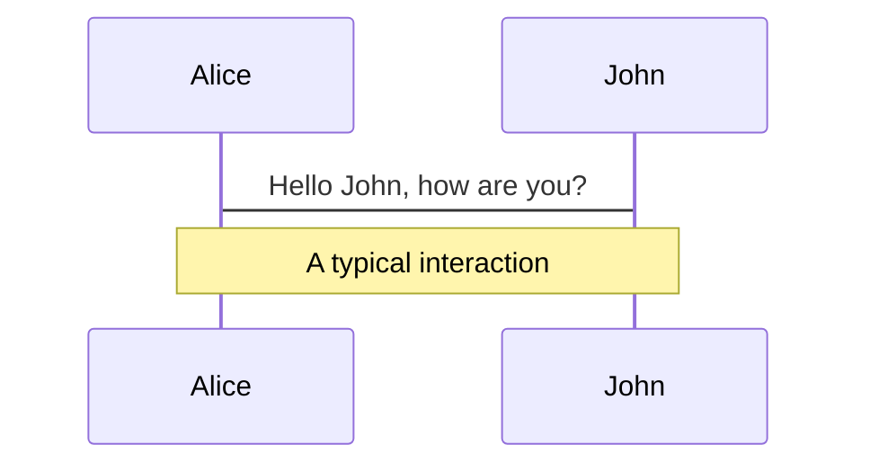
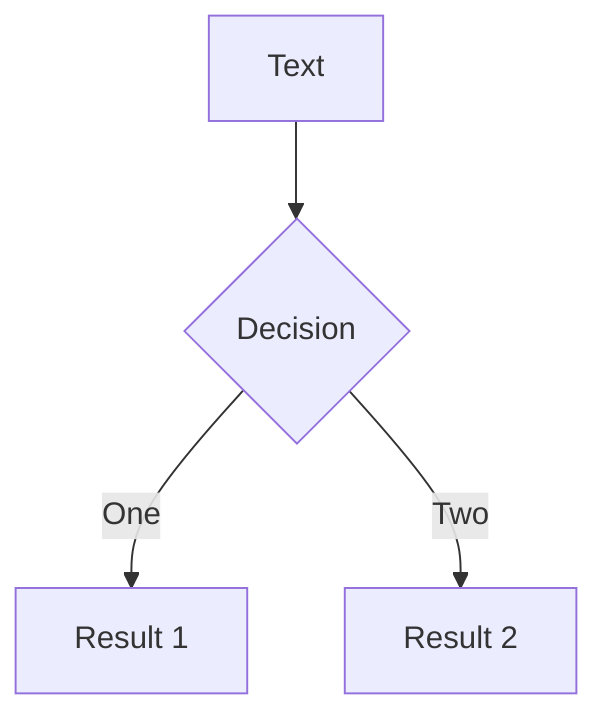
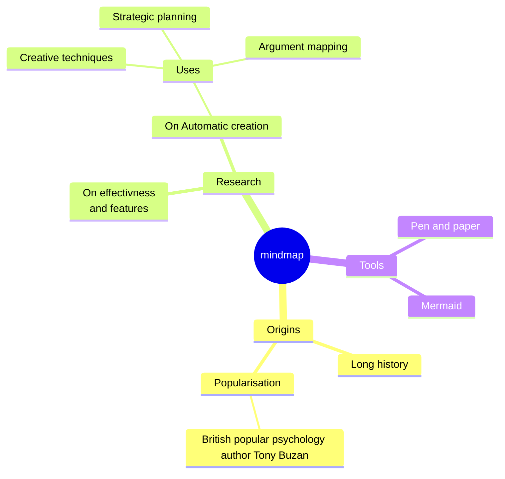
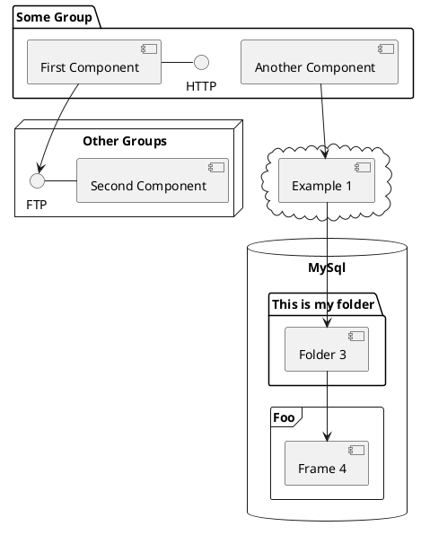

---
# === 全局配置 ===
presentation: 情景模拟
theme: default
title: 情景模拟
transition: none
lineNumbers: true
drawings:
  persist: false

layout: cover
---


# Welcome to Slidev

Presentation slides for developers

<div class="pt-12">
  <span @click="$slidev.nav.next" class="px-2 py-1 rounded cursor-pointer" flex="~ justify-center items-center gap-2" hover="bg-white bg-opacity-10">
    Press Space for next page <div class="i-carbon:arrow-right inline-block"/>
  </span>
</div>

<div class="abs-br m-6 flex gap-2">
  <button @click="$slidev.nav.openInEditor()" title="Open in Editor" class="text-xl slidev-icon-btn opacity-50 !border-none !hover:text-white">
    <div class="i-carbon:edit" />
  </button>
  <a href="https://github.com/slidevjs/slidev" target="_blank" alt="GitHub" title="Open in GitHub"
    class="text-xl slidev-icon-btn opacity-50 !border-none !hover:text-white">
    <carbon-logo-github />
  </a>
</div>

<!--
The last comment block of each slide will be treated as slide notes. It will be visible and editable in Presenter Mode along with the slide. [Read more in the docs](https://sli.dev/guide/syntax.html#notes)
-->

---
transition: fade-out
---

# What is Slidev?

Slidev is a slide maker and accompanying presentation tool designed for developers. It consists of the following features:

- 📝 **Text-based** - focus on the content with Markdown, and apply styles later
- 🎨 **Themable** - themes can be shared and used as npm packages
- 🧑‍💻 **Developer Friendly** - code highlighting, live coding with autocompletion
- 🤹 **Interactive** - embedding Vue components to enhance your slides
- 🎥 **Recording** - built-in recording and camera view
- 📤 **Portable** - export to PDF, PPTX, PNGs, or even a hostable SPA
- 🛠 **Hackable** - virtually anything that's possible on a webpage is possible in Slidev

<br>
<br>

Read more about Slidev in [Why Slidev?](https://sli.dev/guide/why)

<!--
You can have `style` tags in markdown to override the style for the current page.
Learn more: https://sli.dev/guide/syntax#embedded-styles
-->

<style>
h1 {
  background-color: #2B90B6;
  background-image: linear-gradient(45deg, #4EC5D4 10%, #146b8c 20%);
  background-size: 100%;
  -webkit-background-clip: text;
  -moz-background-clip: text;
  -webkit-text-fill-color: transparent;
  -moz-text-fill-color: transparent;
}
</style>

<!--
Here is another comment.
-->

---
layout: default
---

# Table of contents

```html
<Toc minDepth="1" maxDepth="1"></Toc>
```

<Toc maxDepth="1"></Toc>

---
transition: slide-up
level: 2
---

# Navigation

Hover on the bottom-left corner to see the navigation's control panel, [learn more](https://sli.dev/guide/navigation.html)

## Keyboard Shortcuts

|     |     |
| --- | --- |
| <kbd>right</kbd> / <kbd>space</kbd>| next animation or slide |
| <kbd>left</kbd>  / <kbd>shift</kbd><kbd>space</kbd> | previous animation or slide |
| <kbd>up</kbd> | previous slide |
| <kbd>down</kbd> | next slide |

<!-- https://sli.dev/guide/animations.html#click-animation -->

<p v-after class="absolute bottom-23 left-45 opacity-30 transform -rotate-10">Here!</p>

---
layout: image-right
image: https://cover.sli.dev
---

# Code

Use code snippets and get automatic highlighting, and even types hover![^1]

```ts {all|5|7|7-8|10|all} twoslash
// TwoSlash enables TypeScript hover information
// and errors in markdown code blocks
// More at https://shiki.style/packages/twoslash

import { computed, ref } from 'vue'

const count = ref(0)
const doubled = computed(() => count.value * 2)

doubled.value = 2
```

<arrow v-click="[4, 5]" x1="350" y1="310" x2="195" y2="334" color="#953" width="2" arrowSize="1" />

<!-- This allow you to embed external code blocks -->
<!-- <<< @/snippets/external.ts#snippet -->

<!-- Footer -->
[^1]: [Learn More](https://sli.dev/guide/syntax.html#line-highlighting)

<!-- Inline style -->
<style>
.footnotes-sep {
  @apply mt-5 opacity-10;
}
.footnotes {
  @apply text-sm opacity-75;
}
.footnote-backref {
  display: none;
}
</style>

---

# Components

<div grid="~ cols-2 gap-4">
<div>

You can use Vue components directly inside your slides.

We have provided a few built-in components like `<Tweet/>` and `<Youtube/>` that you can use directly. Adding your own custom components is also super easy.

```html
<Counter :count="10" />
```

<!-- ./components/Counter.vue -->
<Counter :count="10" m="t-4" />

Check out [the guides](https://sli.dev/builtin/components.html) for more.

</div>
<div>

```html
<Tweet id="1390115482657726468" />
```

<Tweet id="1390115482657726468" scale="0.65" />

</div>
</div>

<!--
Presenter notes with **bold**, *italic*, and ~~strike~~ text.

Also, HTML elements are valid:
<div class="flex w-full">
  <span style="flex-grow: 1;">Left content</span>
  <span>Right content</span>
</div>
-->

---
class: px-20
---

# Themes

Slidev comes with powerful theming support. Themes can provide styles, layouts, components, or even configurations for tools. Switch between themes on a per-slide basis with just **one change** in your frontmatter:

<div grid="~ cols-2 gap-2" m="t-2">

```yaml
---
theme: default
---
```

```yaml
---
theme: seriph
---
```


</div>

Read more about [How to use a theme](https://sli.dev/guide/theme-addon#use-theme) and
check out the [Awesome Themes Gallery](https://sli.dev/resources/theme-gallery).

---
preload: false
---

# Animations

Animations are powered by [@vueuse/motion](https://motion.vueuse.org/).

```html
<div
  v-motion
  :initial="{ x: -80 }"
  :enter="{ x: 0 }">
  Slidev
</div>
```

<div class="w-60 relative mt-6">
  <div class="relative w-40 h-40">
    
    
    
  </div>

  <div
    class="text-5xl absolute top-14 left-40 text-[#2B90B6] -z-1"
    v-motion
    :initial="{ x: -80, opacity: 0}"
    :enter="{ x: 0, opacity: 1, transition: { delay: 2000, duration: 1000 } }">
    Slidev
  </div>
</div>

<!-- vue script setup scripts can be directly used in markdown, and will only affect the current page -->
<script setup lang="ts">
const final = {
  x: 0,
  y: 0,
  rotate: 0,
  scale: 1,
  transition: {
    type: 'spring',
    damping: 10,
    stiffness: 20,
    mass: 2
  }
}
</script>

<div
  v-motion
  :initial="{ x:35, y: 40, opacity: 0}"
  :enter="{ y: 0, opacity: 1, transition: { delay: 3500 } }">

[Learn More](https://sli.dev/guide/animations.html#motion)

</div>

---

# LaTeX

LaTeX is supported out-of-box powered by [KaTeX](https://katex.org/).

<br>

Inline $\sqrt{3x-1}+(1+x)^2$

Block
$$ {1|3|all}
\begin{array}{c}

\nabla \times \vec{\mathbf{B}} -\, \frac1c\, \frac{\partial\vec{\mathbf{E}}}{\partial t} &
= \frac{4\pi}{c}\vec{\mathbf{j}}    \nabla \cdot \vec{\mathbf{E}} & = 4 \pi \rho \\

\nabla \times \vec{\mathbf{E}}\, +\, \frac1c\, \frac{\partial\vec{\mathbf{B}}}{\partial t} & = \vec{\mathbf{0}} \\

\nabla \cdot \vec{\mathbf{B}} & = 0

\end{array}
$$

<br>

[Learn more](https://sli.dev/guide/syntax#latex)

---

# Diagrams

You can create diagrams / graphs from textual descriptions, directly in your Markdown.

<div class="grid grid-cols-4 gap-5 pt-4 -mb-6">









</div>

[Learn More](https://sli.dev/guide/syntax.html#diagrams)

---
layout: center
class: text-center
---

# Learn More

[Documentation](https://sli.dev) · [GitHub](https://github.com/slidevjs/slidev) · [Showcases](https://sli.dev/showcases.html)


---
layout: center

---


# 结构化小组演练题本
## 20250618

--- 

# <span class="text-audi-red">我是自定义的奥迪红</span>

# 这个也是一级标题
## 母题题本设计

<h1 class="font-black text-6xl text-audi-red">我是自定义的奥迪红</h1>

<p class="font-light text-xl text-gray-500">公务员考试申论解析</p>

<p>这是一个普通文字，<span class="font-bold text-audi-red">这是重点</span>。</p>

## 第三季标题

### 母题精炼

---

# 一级标题

## 二级标题

### 三级标题

---


## 给定资料 1

随着数字经济的快速发展，新就业形态不断涌现。外卖骑手、网约车司机等灵活就业群体规模日益壮大。然而，这一群体在享受就业便利的同时，也面临着职业伤害保障缺失、算法困局等现实痛点。

相关部门指出，要坚持以人民为中心的发展思想，完善劳动保障政策，补齐制度短板。既要支持平台经济健康持续发展，又要切实维护劳动者合法权益，让新就业形态劳动者共享改革发展成果。

---

<div class="bg-white p-6 shadow-float border-l-4 border-audi-red">
  <h3 class="text-audi-red font-bold mb-4">给定资料 1</h3>
  
  <div class="scroll-box">
    <p>
      例题1
新人小李刚进单位，领导让你指导他的工作，但他平时工作马马虎虎，同事交代的工作也经常出错，你多次提醒他，也没有收到调整。后来同事对他不满，导致他情绪低落，他觉得是自己的经验太少，磨炼不够。你怎么劝说？请现场模拟。
例题1
新人小李刚进单位，领导让你指导他的工作，但他平时工作马马虎虎，同事交代的工作也经常出错，你多次提醒他，也没有收到调整。后来同事对他不满，导致他情绪低落，他觉得是自己的经验太少，磨炼不够。你怎么劝说？请现场模拟。
审题
主体及身份：小李（刚进单位-新人），你（指导人）
问题情境：
* 平时工作马马虎虎；
* 同事交代工作经常出错；多次提醒无反馈；同事不满；
* 他情绪低落；觉得经验少；磨练不足；

问法：劝说，现场模拟

开场白
小李，现在忙吗？不忙的话，我们聊会儿。

解决问题
第一步：拉近距离（肯定、理解）
小李，你是我们单位非常有潜力的新员工，领导也对你非常看重，希望你能快速成长。也确实，你是新人，经验这块很缺乏，我都理解。（理解肯定）但是我们都很重视你的，你看，领导上次还让你跟我一起参与下企业宣传的活动，说明领导多重视你呀，而且同事们之前也都愿意帮助你，是不是？所以啊，大家都是很看好你，希望你快速成长的。（举例）
第二步：讲道理
但是，小李，你想想你自己有没有问题呢？经验不足确实是一个问题，但是你工作中粗心大意，而且同事交代的工作也经常出错，这就是你的问题了，如果我们在工作中粗心，很可能解决不好群众的问题，而且也会给同事增加麻烦。（危害）你想想，上次让你统计一个退休群众的工龄，你把他算错了，是不是群众来到我们办公室投诉了你，而且，上次你帮同事做数据，一个小数点写错了，导致领导批评了同事。（举例）所以小李啊，咱们以后工作是不是要更细致一点、更好配合同事工作。
第三步：给建议
所以，小李，以后咱们对待工作一定要高度重视，不能马虎大意。另一方面要养成良好的工作习惯，比如工作对接时要及时回复反馈，又如在遇到数据、表格时要多检查几遍，有不确定的事情要及时向老同事或者领导请教，从细节处入手，一定能做得更好。此外，我也希望你能更加主动地与我沟通。当你遇到问题或者困惑时，不要害怕向我寻求帮助。我会尽力为你提供指导和支持。同时，我也希望你能及时反馈我的建议和提醒，这样我们才能更好地协作，共同解决问题。

结束语
呼应开场
好了，小李，希望你能够振作起来，积极面对未来的工作。我也会一直支持你、帮助你。加油！那你先去忙吧，我就不打扰你了
    </p>
  </div>

</div>

---

# 面试教学形式

- 提高试听的方式方法
- 专业性强
- 小试牛刀
  - 悬念
  - Ai 赋能

1. xues
2. diert 
3. yongbushnag 


---
---
layout: center
class: bg-[#0A0A0A] text-white
---

<style>
@import url('https://fonts.googleapis.com/css2?family=Rajdhani:wght@500;700;900&family=Noto+Sans+SC:wght@400;700&display=swap');

/* 定义局部字体类 */
.font-f1 { font-family: 'Rajdhani', sans-serif; }
.font-cn { font-family: 'Noto Sans SC', sans-serif; }
</style>

<div class="w-full max-w-3xl mx-auto p-4 select-none">
    
    <div class="flex items-center gap-2 mb-2 opacity-80">
        <div class="h-1 w-4 bg-[#A8A9AD]"></div>
        <span class="text-xs font-bold text-[#A8A9AD] font-f1 tracking-wider">
            03. AGENDA / 课程目录
        </span>
    </div>

    <div class="bg-white/5 border border-white/10 p-8 shadow-2xl backdrop-blur-md relative overflow-hidden rounded-sm group hover:border-white/20 transition-all duration-500">
        
        <div class="absolute top-0 right-0 w-1/3 h-full bg-gradient-to-l from-[#FF1E1E]/10 to-transparent skew-x-[-20deg] pointer-events-none"></div>

        <div class="flex justify-between items-center mb-8 relative z-10">
            <h3 class="text-xl font-black text-[#FF1E1E] uppercase tracking-[0.2em] font-f1 italic drop-shadow-md">
                Mission Briefing
            </h3>
            <div class="h-2 w-12 bg-[#FF1E1E] transform -skew-x-12 shadow-[0_0_10px_rgba(255,30,30,0.5)]"></div>
        </div>
        
        <div class="space-y-4 relative z-10">
            
            <div class="flex items-center gap-5 group/item cursor-pointer hover:translate-x-2 transition-transform duration-300 ease-out">
                <div class="w-9 h-9 flex items-center justify-center bg-white/10 text-[#A8A9AD] font-f1 font-bold text-lg group-hover/item:bg-[#FF1E1E] group-hover/item:text-white group-hover/item:shadow-[0_0_15px_rgba(255,30,30,0.6)] transition-all duration-300 transform -skew-x-12">
                    <span class="transform skew-x-12">01</span>
                </div>
                <div class="flex-1 border-b border-white/10 pb-2 group-hover/item:border-[#FF1E1E]/50 transition-colors duration-300">
                    <span class="text-lg font-bold text-gray-300 group-hover/item:text-white transition-colors duration-300 font-cn">
                        第一部分 &nbsp; <span class="font-normal opacity-70 text-sm ml-2">考察重点</span>
                    </span>
                </div>
            </div>

            <div class="flex items-center gap-5 group/item cursor-pointer hover:translate-x-2 transition-transform duration-300 ease-out">
                <div class="w-9 h-9 flex items-center justify-center bg-white/10 text-[#A8A9AD] font-f1 font-bold text-lg group-hover/item:bg-[#FF1E1E] group-hover/item:text-white group-hover/item:shadow-[0_0_15px_rgba(255,30,30,0.6)] transition-all duration-300 transform -skew-x-12">
                    <span class="transform skew-x-12">02</span>
                </div>
                <div class="flex-1 border-b border-white/10 pb-2 group-hover/item:border-[#FF1E1E]/50 transition-colors duration-300">
                    <span class="text-lg font-bold text-gray-300 group-hover/item:text-white transition-colors duration-300 font-cn">
                        第二部分 &nbsp; <span class="font-normal opacity-70 text-sm ml-2">思路汇总</span>
                    </span>
                </div>
            </div>

            <div class="flex items-center gap-5 group/item cursor-pointer hover:translate-x-2 transition-transform duration-300 ease-out">
                <div class="w-9 h-9 flex items-center justify-center bg-white/10 text-[#A8A9AD] font-f1 font-bold text-lg group-hover/item:bg-[#FF1E1E] group-hover/item:text-white group-hover/item:shadow-[0_0_15px_rgba(255,30,30,0.6)] transition-all duration-300 transform -skew-x-12">
                    <span class="transform skew-x-12">03</span>
                </div>
                <div class="flex-1 border-b border-white/10 pb-2 group-hover/item:border-[#FF1E1E]/50 transition-colors duration-300">
                    <span class="text-lg font-bold text-gray-300 group-hover/item:text-white transition-colors duration-300 font-cn">
                        第三部分 &nbsp; <span class="font-normal opacity-70 text-sm ml-2">例题精讲</span>
                    </span>
                </div>
            </div>

             <div class="flex items-center gap-5 group/item cursor-pointer hover:translate-x-2 transition-transform duration-300 ease-out">
                <div class="w-9 h-9 flex items-center justify-center bg-white/10 text-[#A8A9AD] font-f1 font-bold text-lg group-hover/item:bg-[#FF1E1E] group-hover/item:text-white group-hover/item:shadow-[0_0_15px_rgba(255,30,30,0.6)] transition-all duration-300 transform -skew-x-12">
                    <span class="transform skew-x-12">04</span>
                </div>
                <div class="flex-1 border-b border-white/10 pb-2 group-hover/item:border-[#FF1E1E]/50 transition-colors duration-300">
                    <span class="text-lg font-bold text-gray-300 group-hover/item:text-white transition-colors duration-300 font-cn">
                        第四部分 &nbsp; <span class="font-normal opacity-70 text-sm ml-2">高分技巧</span>
                    </span>
                </div>
            </div>

        </div>
    </div>
</div>

---

